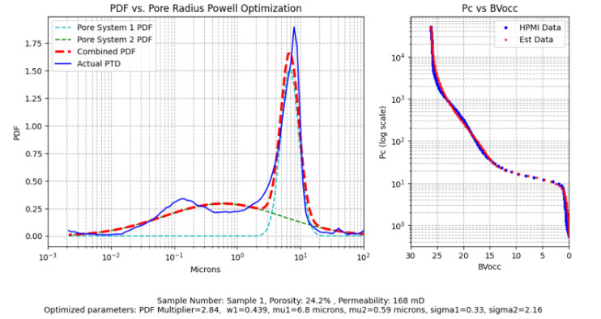

**Open Petro Data and Utilities (OPDU): MICP-Analytics**

>

Welcome to the **Open Petro Data and Utilities (OPDU)** repository, featuring **MICP-Analytics**, a collection of open-source methods for loading, correcting, and processing Mercury Injection Capillary Pressure (MICP) data. This includes High Pressure Mercury Injection (HPMI) data, which is essential for obtaining fitting parameters to model the entire capillary pressure curve. These methods provide a comprehensive pore system characterization for each sample.

**Method 1: Gaussian Density Function(1)**

This method implements the approach proposed by **Xu and Torres-Verdin (1)**, using a core-based petrophysical rock classification to quantify pore-system orthogonality via a bimodal Gaussian density function. A Jupyter Notebook, ready to be run directly in Google Colab, is available at the following link:

[Run in Google Colab](https://github.com/PDDA-OPDU/MICP-Analytics/blob/main/Gaussian_Clerke_Spreadsheet/Panel_Bvocc_ver6_GitHub_colab.ipynb)

>

**Method 2: Thomeer Hyperboal(2)**

The second method uses the **Thomeer (2)** approach, fitting a hyperbola to HPMI Capillary Pressure data to derive three key parameters per pore system. This method was the foundation of **Clerke’s (3)** work, which provided a full pore system characterization for the Arab D complex carbonate reservoirs in Saudi Arabia. An interactive Jupyter Notebook for defining the Thomeer parameters is available, although it requires Python's qt and therefore cannot be run in Colab. The notebook and associated data can be downloaded and executed in a local Python environment:

[Download Notebook](https://github.com/PDDA-OPDU/MICP-Analytics/blob/main/Thomeer_from_Clerke_spreadsheet/Thomeer_from_Pc_curve_fit_auto-use-picks-Auto-Put_on_GitHub_read_Edspreadsheet_ver2.ipynb)

>

**Example of MICP-Analytics:**

>

---
---
## REFERENCES:
1.  Xu, C and Torres-Verdin, C, "Core-Based Petrophysical Rock Classification by Quantifying Pore-System Orthogonality with a Bimodal Gaussian Density Function", SCA2013-079, September 2013.
2.  Thomeer, J.H.M., 1960, Introduction of a Pore Geometrical Factor Defined by the Capillary Pressure Curve, Journal of Petroleum Technology, 12(3): 73-77.
3.  Phillips, E. C., Buiting, J. M., Clerke, E. A, “Full Pore System Petrophysical Characterization Technology for Complex Carbonate Reservoirs – Results from Saudi Arabia”, AAPG, 2009 Extended Abstract.
4.  Clerke, E. A., Mueller III, H. W., Phillips, E. C., Eyvazzadeh, R. Y., Jones, D. H., Ramamoorthy, R., Srivastava, A., (2008) “Application of Thomeer Hyperbolas to decode the pore systems, facies and reservoir properties of the Upper Jurassic Arab D Limestone, Ghawar field, Saudi Arabia: A Rosetta Stone approach”, GeoArabia, Vol. 13, No. 4, p. 113-160, October 2008.
