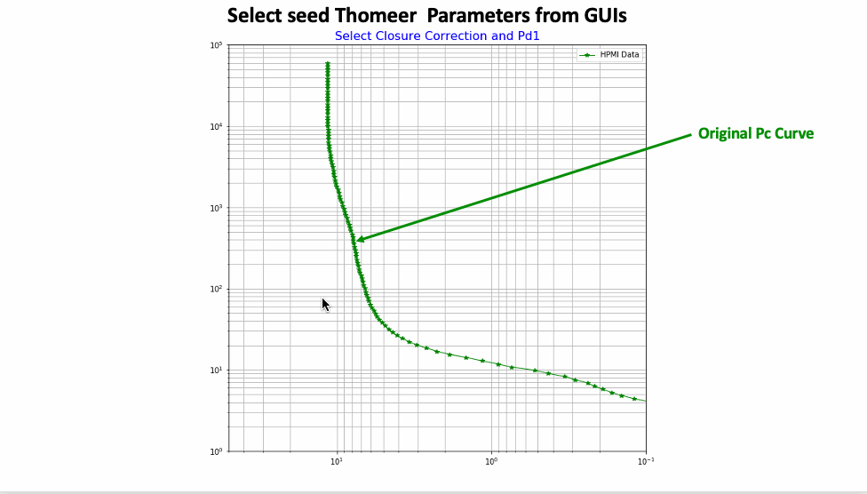

**Open Petro Data and Utilities (OPDU): MICP-Analytics**

>

Welcome to the **Open Petro Data and Utilities (OPDU)** repository, featuring **MICP-Analytics**, a collection of open-source methods for loading, correcting, and processing Mercury Injection Capillary Pressure (MICP) data. This includes High Pressure Mercury Injection (HPMI) data, which is essential for obtaining fitting parameters to model the entire capillary pressure curve. These methods provide a comprehensive pore system characterization for each sample.

---
**Method 1: Gaussian Density Function *(1)*:**

**a)** This method implements the approach proposed by **Xu and Torres-Verdin *(1)***, using a core-based petrophysical rock classification to quantify pore-system orthogonality via a bimodal Gaussian density function. A Jupyter Notebook, ready to be run directly in Google Colab, is available at the following link:

[Run Alpha Gaussian Parameter Version in Google Colab](https://github.com/PDDA-OPDU/MICP-Analytics/blob/main/Gaussian_Clerke_Spreadsheet/Panel_Bvocc_ver6_GitHub_colab_GEV_CDF.ipynb)

>

**b)** Using the same Gaussian Density Function, we offer a fully automated Jupyter Notebook that reads in multiple HPMI samples from a single spreadsheet and processes each sample, one at a time, saving both the Gaussian fit parameters and Plots (if this option is turned on).

*We have used 35 samples from Hugoton Field HPMI data for this example. This process runs well. We are working from the Cumulative Density Function to determine the Gaussian parameters to fit the HPMI data and then using the PDF to create a PTD for the samlple.

[Run Alpha Gaussian Parameter Auto Version in Google Colab](https://github.com/PDDA-OPDU/MICP-Analytics/blob/main/Gaussian_KGS_Data_CDF_PDF/CDF_PDF_Distributions_KGS_data.ipynb)

**c)** We are also using a Generalized Extreme Value (GEV) distribution model from SciPy’s genextreme function. The modeled data shows a slight skew with a shape parameter ξ of -0.5 applied to both pore systems. This GEV method aligns well with the typical characteristics of MICP PTD data. The GEV model may offer a more nuanced representation of the pore systems than a pure Gaussian distrubution. 

[Run Alpha Generalized Extreme Value(GEV) method in Auto Version of Google Colab](https://github.com/PDDA-OPDU/MICP-Analytics/blob/main/Gaussian_GenExtremeValues_CDF_PDF/GenExtremeValue_CDF_PDF_distributions.ipynb)

>

---
**Method 2: Thomeer Hyperbola *(2)*:**

**a)** The second method uses the **Thomeer *(2)*** approach, fitting a hyperbola to HPMI Capillary Pressure data to derive three key parameters per pore system. This method was the foundation of **Clerke’s *(3)*** work, which provided a full pore system characterization for the Arab D complex carbonate reservoirs in Saudi Arabia. An interactive Jupyter Notebook for defining the Thomeer parameters is available, although it requires Python's qt and therefore cannot be run in Colab. The notebook and associated data can be downloaded and executed in a local Python environment:

[Download Notebook](https://github.com/PDDA-OPDU/MICP-Analytics/blob/main/Thomeer_from_Clerke_spreadsheet/Thomeer_from_Pc_curve_fit_auto-use-picks-Auto-Put_on_GitHub_read_Edspreadsheet_ver2.ipynb)

>

**b)** We have also added a Jupyter Notebook to evaluate the KGS data for Hugoton Field's HPMI data to determine the Thomeer parameters. This is still alpha code, but it does work rather well. After running each sample and saving the results to Excel, we then plot all the data. We have found an excellent correlation of the Mode of the PTD vs. core Permeability. The Mode of the PTD is calculated from the Thomeer parameters:

    Mode of PTD (microns) = exp(-1.15 * G1) * (214/Pd1)/2

where the r2 is 0.94.

>

[Run Alpha Thomeer Parameter Auto Version in Google Colab](https://github.com/PDDA-OPDU/MICP-Analytics/blob/main/Thomeer_Param_from_KGS_Data/Panel_Bvocc_Thomeer_Parameters_optimization_read_KGS_ver3.ipynb)

---
**Example of a Comprehensive MICP-Analytics Assessment of Data:**

>

---
---
## REFERENCES:
1.  Xu, C., Torres-Verdín, C. Pore System Characterization and Petrophysical Rock Classification Using a Bimodal Gaussian Density Function. Math Geosci 45, 753–771 (2013). https://doi.org/10.1007/s11004-013-9473-2
2.  Xu, C and Torres-Verdin, C, "Core-Based Petrophysical Rock Classification by Quantifying Pore-System Orthogonality with a Bimodal Gaussian Density Function", SCA2013-079, September 2013.
3.  Thomeer, J.H.M., 1960, Introduction of a Pore Geometrical Factor Defined by the Capillary Pressure Curve, Journal of Petroleum Technology, 12(3): 73-77.
4.  Clerke, E. A., Mueller III, H. W., Phillips, E. C., Eyvazzadeh, R. Y., Jones, D. H., Ramamoorthy, R., Srivastava, A., (2008) “Application of Thomeer Hyperbolas to decode the pore systems, facies and reservoir properties of the Upper Jurassic Arab D Limestone, Ghawar field, Saudi Arabia: A Rosetta Stone approach”, GeoArabia, Vol. 13, No. 4, p. 113-160, October 2008.
5.  Phillips, E. C., Buiting, J. M., Clerke, E. A, “Full Pore System Petrophysical Characterization Technology for Complex Carbonate Reservoirs – Results from Saudi Arabia”, AAPG, 2009 Extended Abstract.
