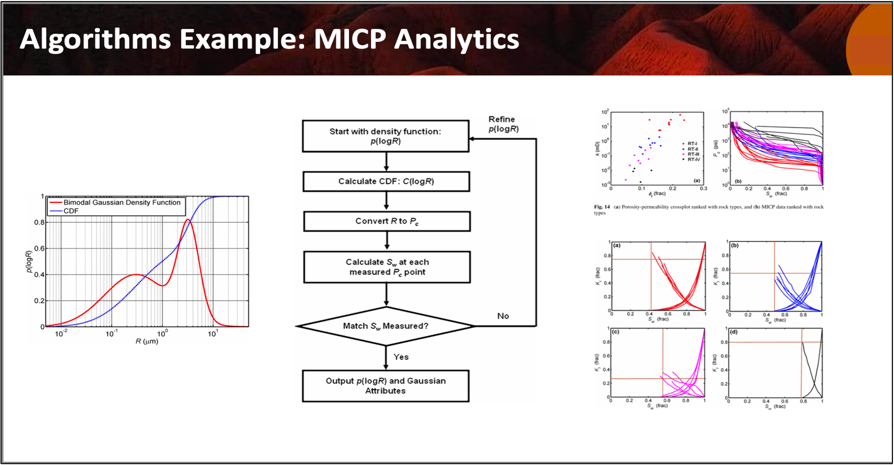

**Open Petro Data and Utilities (OPDU): MICP-Analytics**

>

Welcome to the **Open Petro Data and Utilities (OPDU)** repository, featuring **MICP-Analytics**, a collection of open-source methods for loading, correcting, and processing Mercury Injection Capillary Pressure (MICP) data. This includes High Pressure Mercury Injection (HPMI) data, which is essential for obtaining fitting parameters to model the entire capillary pressure curve. These methods provide a comprehensive pore system characterization for each sample.

---
**Method 1: Gaussian Density Function *(1)*:**

Using a **Gaussian Cumulative Density Function**, we offer a fully automated Jupyter Notebook that reads in multiple HPMI samples from a single spreadsheet and processes each sample, one at a time, saving both the Gaussian fit parameters and Plots.

We have used 35 samples from Hugoton Field HPMI data for this example. This process runs well. We are working from the Cumulative Density Function to determine the Gaussian parameters to fit the HPMI data and then using the PDF function to create a PTD for each sample.

[Run Alpha Gaussian Parameter Auto Version in Google Colab](https://github.com/PDDA-OPDU/MICP-Analytics/blob/main/Gaussian_KGS_Data_CDF_PDF/CDF_PDF_Distributions_KGS_data.ipynb)

---
**Method 2: Thomeer Hyperbola *(2)*:**

We have also added a Jupyter Notebook to evaluate the KGS data for Hugoton Field's HPMI data to determine the Thomeer parameters from the HPMI data. This is still alpha code, but it does work rather well. After running each sample and saving the results to Excel, we then plot all the data in search of correlations. We have found an excellent correlation of the Mode of the PTD vs. core Permeability. The Mode of the PTD is calculated from the Thomeer parameters:

    Mode of PTD (microns) = exp(-1.15 * G1) * (214/Pd1)/2

where the r2 is 0.91.

[Run Alpha Thomeer Parameter Auto Version in Google Colab](https://github.com/PDDA-OPDU/MICP-Analytics/blob/main/Thomeer_Param_from_KGS_Data/Panel_Bvocc_Thomeer_Parameters_optimization_read_KGS_ver3.ipynb)

---
**Example of a Comprehensive MICP-Analytics Assessment of Data:**

>

---
---
## REFERENCES:
1.  Xu, C., Torres-Verdín, C. Pore System Characterization and Petrophysical Rock Classification Using a Bimodal Gaussian Density Function. Math Geosci 45, 753–771 (2013). https://doi.org/10.1007/s11004-013-9473-2
2.  Xu, C and Torres-Verdin, C, "Core-Based Petrophysical Rock Classification by Quantifying Pore-System Orthogonality with a Bimodal Gaussian Density Function", SCA2013-079, September 2013.
3.  Thomeer, J.H.M., 1960, Introduction of a Pore Geometrical Factor Defined by the Capillary Pressure Curve, Journal of Petroleum Technology, 12(3): 73-77.
4.  Clerke, E. A., Mueller III, H. W., Phillips, E. C., Eyvazzadeh, R. Y., Jones, D. H., Ramamoorthy, R., Srivastava, A., (2008) “Application of Thomeer Hyperbolas to decode the pore systems, facies and reservoir properties of the Upper Jurassic Arab D Limestone, Ghawar field, Saudi Arabia: A Rosetta Stone approach”, GeoArabia, Vol. 13, No. 4, p. 113-160, October 2008.
5.  Phillips, E. C., Buiting, J. M., Clerke, E. A, “Full Pore System Petrophysical Characterization Technology for Complex Carbonate Reservoirs – Results from Saudi Arabia”, AAPG, 2009 Extended Abstract.
6. Costa Gomes J, Geiger S, Arnold D. The Design of an Open-Source Carbonate Reservoir Model. Petroleum Geoscience, https://doi.org/10.1144/petgeo2021-067
7. J.J.M. Buiting, Fully Upscaled Saturation-Height Functions for Reservoir Modeling Based on Thomeer's Method for Analyzing Capillary Pressure Measurements, SPE Paper 105139, 2007.
8. J.J.M. Buiting, E.A. Clerke, Permeability from porosimetry measurements: Derivation
for a tortuous and fractal tubular bundle, Journal of Petroleum Science and Engineering 108 (2013) 267–278.
